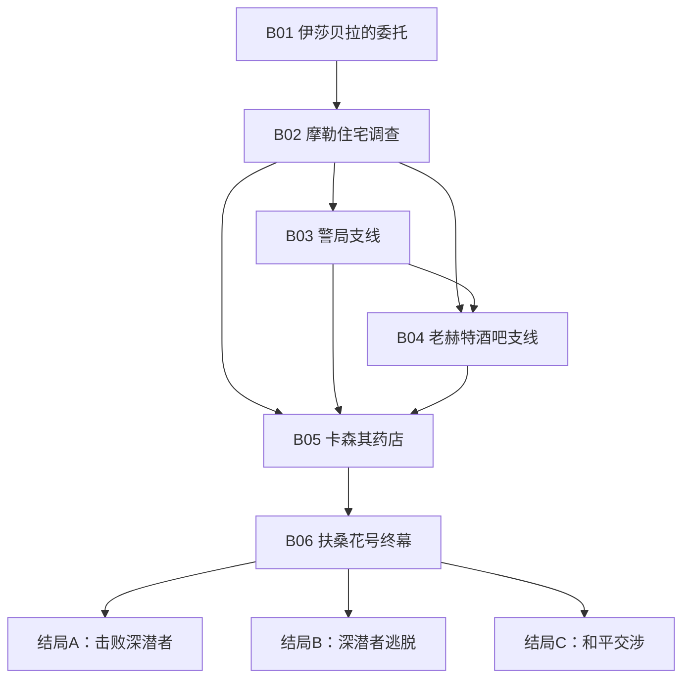
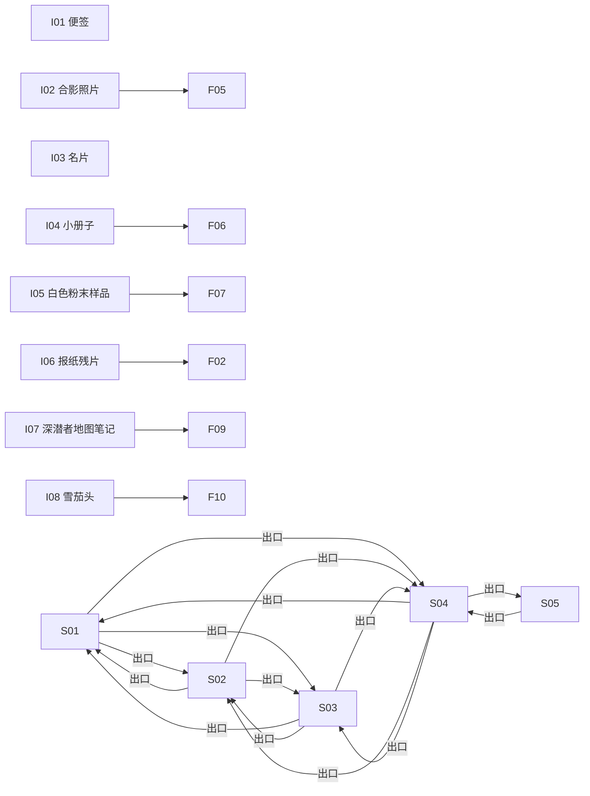

<!-- AUTO-GENERATED by npm run scenario:docs. DO NOT EDIT. -->
# 《雾中消逝》KP 模组手册

- 模组 ID：`wuzhongxiaoshi`
- 内容版本：`1.1.5`
- 内容哈希：`4d651496e9200891`
- 规则：COC 第七版风格 D100
- 时间：1920年7月13日，英国伦敦
- 作者：舒爾茲上尉

## 剧情主干

### 第一幕：接受委托

- **B01 伊莎贝拉的委托**（mandatory）场景：S01；目标：O01
- **B02 摩勒住宅调查**（mandatory）场景：S01；目标：O02

### 第二幕：街区调查

- **B03 警局支线**（optional）场景：S02；目标：O03
- **B04 老赫特酒吧支线**（optional）场景：S03；目标：O04
- **B05 卡森其药店**（mandatory）场景：S04；目标：O05

### 终幕：扶桑花号

- **B06 扶桑花号终幕**（finale）场景：S05；目标：O06、O07、O08

## 剧情图

## 线索依赖图

## 场景与合法出口

- **S01 摩勒住宅**：纽伦上街101-102号的维多利亚式别墅，伊莎贝拉·摩勒在此等待调查员。 出口：S02(10分钟)、S03(10分钟)、S04(20分钟)
- **S02 上城区第二分局**：距离摩勒住宅约十分钟路程，洛夫·蒙特利尔局长在这里办公。 出口：S01(10分钟)、S03(10分钟)、S04(15分钟)
- **S03 老赫特酒吧**：街区内昏暗嘈杂的小酒馆，空气里弥漫着烟草和廉价酒气。 出口：S01(10分钟)、S02(10分钟)、S04(10分钟)
- **S04 卡森其药店**：贝尔街14号一间废弃多年的药店，门面破败，门锁仍在，内部没有营业迹象。 出口：S01(20分钟)、S02(15分钟)、S03(10分钟)、S05(25分钟)
- **S05 泰晤士港·扶桑花号**：泰晤士港的偏僻泊位，浓雾覆盖水面，扶桑花号正准备离港。 出口：S04(25分钟)

## 线索与失败推进

- **I01 便签**：书房桌面上写有“别来找我”的便签，墨迹尚未完全干透。 检定：侦查/普通；失败推进：即使失败也能看到文字，但无法判断笔触异常，并推进5分钟。
- **I02 合影照片**：书桌抽屉里一张埃里克与蒙特利尔的旧合影。 检定：侦查/普通；失败推进：失败仍能发现照片，但会惊动伊莎贝拉并推进10分钟。
- **I03 名片**：一张印有埃里克旧公司信息的泛黄名片。 检定：侦查/自动；失败推进：公开摆放，无需检定。
- **I04 小册子**：夹在书架缝隙里的普通小册子，夹页似乎受过特殊处理。 检定：侦查/普通；失败推进：失败仍发现受潮夹页，艾达可通过加热或医学知识恢复隐写内容，但推进15分钟。
- **I05 白色粉末样品**：车库暗格中的小袋白色粉末，颗粒细腻，气味淡苦。 检定：医学/普通；失败推进：失败只能确认其可疑并推进10分钟，之后可由药店记录或蒙特利尔反应补证。
- **I06 报纸残片**：垃圾桶中的报纸残片，保留着扫毒英雄通稿和人物照片的一部分。 检定：侦查/普通；失败推进：失败仍能带走残片，之后可与合影比对。
- **I07 深潜者地图笔记**：后厅油布包中的潮湿手绘地图，标注了港口偏僻泊位。 检定：侦查/普通；失败推进：失败仍能从残片辨认扶桑花号泊位，但暴徒或深潜者警觉度增加。
- **I08 雪茄头**：柜台附近未燃尽的雪茄头，品牌标记仍然清晰。 检定：侦查/普通；失败推进：失败仍可收集，回看埃里克物品后自动完成比对。

## 不可变真相

- **F01**：埃里克·摩勒参与毒品运输，并被同伙绑架在扶桑花号上。
- **F02**：洛夫·蒙特利尔与埃里克私下勾连，并会阻挠调查。
- **F03**：深潜者混种藏身卡森其药店，并计划于7月14日乘船离开。
- **F11**：调查员见过蒙特利尔后，晚间到贝尔街会遭遇三名暴徒。
- **F12**：扶桑花号战斗持续七轮后，深潜者会带船逃脱。
- **F13**：扶桑花号的深潜者只要求带走走私货物并安全离港；若调查员承诺不追击，他们愿意释放埃里克。

## 剧情事件

- **EV_ACCEPT_COMMISSION 接受委托** [manual/once]：伊莎贝拉确认委托，并提供父亲失踪日期、警方无进展以及老赫特酒吧这一生活线索。
- **EV_OPENING_RECOVERY 委托回收** [automatic/once]：伊莎贝拉提高酬金并把父亲常去老赫特酒吧的情况写入委托资料，调查正式开始。
- **EV_FIND_I01 发现便签** [manual/once]：调查员发现写有“别来找我”的便签。
- **EV_FAIL_I01 失败推进·便签** [manual/once]：虽然没能判断笔触异常，调查员仍看清便签上的“别来找我”，但耽误了五分钟。
- **EV_FIND_I02 发现合影** [manual/once]：合影把埃里克与蒙特利尔联系起来，警局成为合法调查方向。
- **EV_FAIL_I02 失败推进·合影** [manual/once]：翻找声惊动了伊莎贝拉，但她仍认出合影中的蒙特利尔；调查因此耽误十分钟。
- **EV_FIND_I03 发现名片** [manual/once]：调查员收起埃里克旧公司的名片。
- **EV_DISCOVER_I04 发现小册子** [manual/once]：调查员在书架夹缝中发现夹页受过特殊处理的小册子，但尚未读出隐藏内容。
- **EV_FAIL_I04 失败推进·小册子** [manual/once]：调查员仍找到受潮的小册子，却没能读出隐藏内容；反复翻找耽误十五分钟。
- **EV_FIND_I04 破译小册子** [manual/once]：加热显出隐写文字“贝尔街14号卡森其药店”，同时强化了老赫特这一街区线索。
- **EV_FIND_I05 发现粉末样品** [manual/once]：医学分析确认暗格中的白色粉末是高纯度鸦片。
- **EV_FAIL_I05 失败推进·粉末** [manual/once]：艾达只能确认白色粉末样品十分可疑，无法立即定性；检查耽误十分钟。
- **EV_FIND_I06 发现报纸残片** [manual/once]：报纸残片保留着蒙特利尔的扫毒英雄通稿，可与合影交叉比对。
- **EV_FAIL_I06 失败推进·报纸** [manual/once]：调查员仍带走了破损严重的报纸残片，人物照片需要之后与合影比对。
- **EV_HOUSE_RECOVERY 住宅主线回收** [automatic/once]：伊莎贝拉整理父亲遗物时发现小册子受热显字，代价是调查耗去了额外时间。
- **EV_RECOVER_I01 恢复便签** [automatic/once]：调查员从残留纸片中恢复了便签正文。
- **EV_RECOVER_I02 恢复合影** [automatic/once]：伊莎贝拉确认照片上的另一人是蒙特利尔。
- **EV_RECOVER_I03 恢复名片** [automatic/once]：伊莎贝拉从通讯录中抄出名片上的旧公司信息。
- **EV_RECOVER_I04 恢复小册子线索** [automatic/once]：烧剩的夹页仍留下“贝尔14”字样，足以继续调查。
- **EV_RECOVER_I05 恢复粉末证据** [automatic/once]：暗格残留物仍能证明这里存放过鸦片。
- **EV_RECOVER_I06 恢复报纸信息** [automatic/once]：伊莎贝拉认出残片上的人物是蒙特利尔。
- **EV_MEET_MONTREAL 蒙特利尔阻挠调查** [manual/once]：蒙特利尔回避关键问题；调查员离开后，他秘密派出暴徒。
- **EV_BARTENDER_RAT 酒保提供“老鼠”线索** [manual/once]：酒保在得到酒水、金钱或可信理由后，指出贝尔街14号的废弃药店。
- **EV_S04_FOG 深潜者撤离与浓雾** [sceneEnter/once]：非人的身影从后门撤离，咒术浓雾涌入药店；所有在场调查员承受最低1点SAN损失。
- **EV_S04_MAP 获得地图笔记** [sceneEnter/once]：后厅油布包中的地图笔记标出了泰晤士港扶桑花号的位置。
- **EV_FAIL_I07 失败推进·地图** [manual/once]：地图笔记虽被水浸坏，残片仍能定位泰晤士港扶桑花号；敌人警觉且调查耽误十分钟。
- **EV_S04_CIGAR 发现雪茄头** [manual/once]：雪茄头与埃里克常用品牌一致，证明他近期来过药店。
- **EV_FAIL_I08 失败推进·雪茄** [manual/once]：调查员仍收起雪茄头，但暂时无法辨认品牌，需与埃里克的物品比对。
- **EV_S04_THUGS 暴徒抵达贝尔街** [sceneEnter/once]：蒙特利尔派来的三名暴徒封住退路，试图夺走证据。
- **EV_PHARMACY_RECOVERY 药店主线回收** [automatic/once]：即使地图受损，水渍和船名残片仍足以定位扶桑花号，但敌人获得了额外准备时间。
- **EV_RECOVER_I07 恢复港口位置** [automatic/once]：地图残片与港口灯号相互印证，恢复了扶桑花号泊位。
- **EV_RECOVER_I08 恢复雪茄证据** [automatic/once]：柜台残留的烟灰品牌仍能与埃里克的雪茄盒对应。
- **EV_CHOOSE_COMBAT 选择战斗路线** [manual/once]：调查员以武力阻止深潜者，扶桑花号逃脱时钟开始计数。
- **EV_CHOOSE_NEGOTIATION 选择交涉路线** [manual/once]：调查员暂缓攻击，与扶桑花号交涉代表保持距离，尝试听懂深潜者的诉求。
- **EV_COMBAT_ROUND 战斗轮推进** [turnEnd/repeatable]：船员继续收缆，扶桑花号距离逃脱又近一轮。
- **EV_COMBAT_ATTACK 攻击深潜者** [manual/repeatable]：调查员抓住机会攻击一名仍在抵抗的深潜者。
- **EV_COMBAT_HIT 有效命中深潜者** [checkResolved/repeatable]：攻击奏效，一名深潜者失去战斗能力。
- **EV_COMBAT_WIN 击败深潜者** [automatic/once]：四名深潜者失去战斗能力，调查员及时救出埃里克。
- **EV_NEGOTIATION_LISTEN 听懂深潜者诉求** [manual/repeatable]：调查员需要先通过聆听检定理解对方的真正诉求。
- **EV_NEGOTIATION_UNDERSTOOD 理解深潜者诉求** [checkResolved/repeatable]：调查员听懂了深潜者的底线：他们只要求带走走私货物并安全离港；若调查员承诺不追击，他们愿意释放埃里克。现在必须完成说服。
- **EV_NEGOTIATION_LISTEN_FAILED 失败推进·交涉聆听** [checkResolved/repeatable]：调查员没能听清非人声调，但反复手势仍表明深潜者只要求带走走私货物并安全离港；迟疑消磨了对方耐心，仍可尝试说服其释放埃里克，但难度提高为极难。
- **EV_NEGOTIATION_SUCCESS 交涉成功** [checkResolved/once]：说服奏效，深潜者释放埃里克并同意和平离港。
- **EV_NEGOTIATION_FAILED 交涉破裂** [checkResolved/once]：最后的说服没有奏效，深潜者终止交涉，扶桑花号带着埃里克驶入浓雾。
- **EV_RESCUE_ERIC 救出埃里克** [automatic/once]：埃里克获救，但其走私身份也随证据暴露。

## 结局

- **结局A：击败深潜者**：深潜者被击败，埃里克获救，调查员阻止了扶桑花号逃脱。
- **结局C：和平交涉**：调查员听懂并说服深潜者释放埃里克，扶桑花号随后和平离港。
- **结局B：深潜者逃脱**：调查员未能及时救出埃里克，扶桑花号载着深潜者和埃里克消失在泰晤士河浓雾中。

## 规则支持矩阵

| ID | 支持模式 | 触发 | 描述 |
|---|---|---|---|
| RULE_MONTREAL_LANGUAGE | enforced | checkRequested | 对蒙特利尔使用语言类技能默认失败；心理学提高为困难难度。 |
| RULE_TURN_TIME | enforced | afterAction | 每个完成的正式DM回合推进五分钟世界时间。 |
| RULE_S04_ENTRY | enforced | sceneEnter | S04首次进入触发深潜者撤离、浓雾和地图笔记事件。 |
| RULE_S04_THUGS | enforced | sceneEnter | 见过蒙特利尔且19:00后进入S04时触发暴徒伏击。 |
| RULE_HYBRID_SAN | enforced | sceneEnter | 首次清楚目睹深潜者或浓雾咒术时，全队最低损失1点SAN。 |
| RULE_FUSANG_TIMER | enforced | clockTick | 战斗路线第七轮结束时扶桑花号逃脱并进入结局B。 |
| RULE_LIGHT_COMBAT | narrator_assisted | combatStart | 当前仅结构化敌方HP、击败数量和回合时钟；先攻、弹药与战术移动由Narrator辅助裁决。 |
